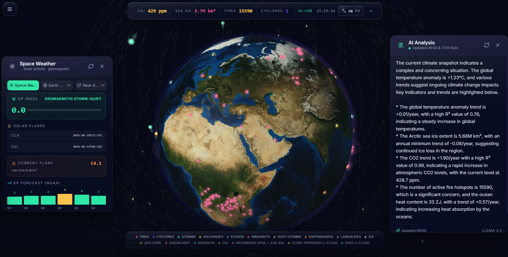
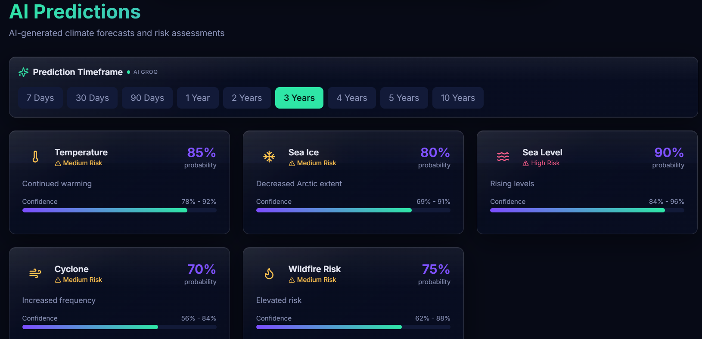
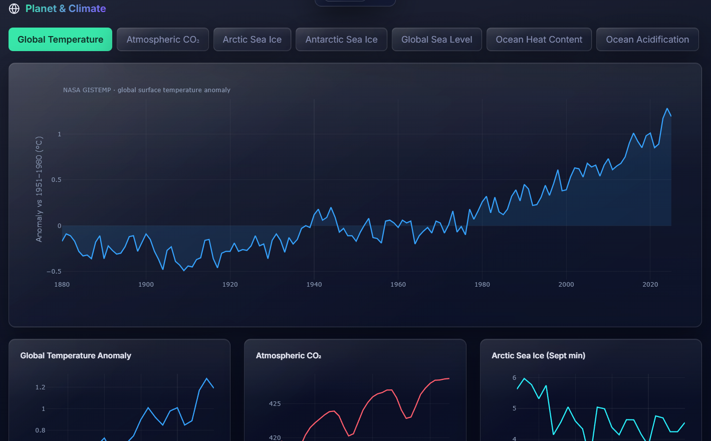

# 🌍 Climate Intelligence

**AI-Powered Global Climate Monitoring Dashboard**

Real-time global climate monitoring powered by Python, Artificial Intelligence, satellite observations, and interactive 3D visualization.

[🚀 Live Demo](https://aiclimateintelligence.vercel.app) · [📡 API Docs](https://ai-climate-intelligence.onrender.com/docs) · [📧 Contact](#support)

---

## The Experience

**Climate Intelligence** is a real-time, mission-control style dashboard for planet Earth. A full-screen **interactive 3D globe** — built with WebGL — serves as the centerpiece, layered with live climate data and AI forecasts. No install. No signup. Available in 7 languages.

---

## Interface Tour

### 🪐 The 3D Globe
The homepage renders a photo-real Earth suspended in a star field. Rotate by drag, zoom by scroll. Climate layers — temperature, CO₂, methane, wildfires, ice, rainfall, wind, pollution — can be toggled on the fly. Real-time event markers (NASA FIRMS wildfires, NOAA cyclones) dot the surface and scale with your zoom.

### 👁️ The AI Analysis Panel
Pops in from the right. Twice daily (09:00 & 17:00 Kyiv) an LLM synthesises today's climate situation — temperature records, weather extremes, atmospheric signals — in your selected language.

### 🌌 The Space & Asteroids Panel
Lives on the left. Shows the planetary geomagnetic Kp index, solar X-ray flux, coronal mass ejections, 3-day Kp forecast, and near-Earth asteroid approaches for the coming week. Includes a city picker for local space-weather context.

### 📊 The Dashboard
Under the globe, scroll reveals a glass-morphic dashboard: animated KPI cards, a live global event feed, and an AI-generated climate summary — all updating in near-real time.

### 📈 Analytics & Predictions
Dedicated pages break out historical climate series into interactive Plotly charts. The predictions page delivers AI-generated forecasts with probability scores, confidence bands, and risk levels across 7-day, 30-day, 90-day, and 1-year horizons.

---

## Screenshots

| Interactive 3D Globe | AI Predictions | Analytics |
|:---:|:---:|:---:|
|  |  |  |

---

## At a Glance

| Capability | Detail |
|---|---|
| **Languages** | English, Ukrainian, German, Polish, French, Italian, Georgian — all UI and AI content |
| **Data providers** | NASA, NOAA, NSIDC, Open-Meteo, Copernicus, USGS, NASA DONKI, NASA NeoWs |
| **AI engine** | Groq `llama-3.3-70b-versatile` — analysis & predictions |
| **Backend** | FastAPI + Uvicorn, async SQLAlchemy, PostgreSQL (Neon) |
| **3D engine** | Three.js · React Three Fiber · Drei |
| **Deployment** | Frontend on Vercel · Backend on Render |

---

## API Endpoints

### Core

| Endpoint | Returns |
|---|---|
| `GET /` | API info |
| `GET /api/health` | Service health |
| `GET /api/kpi` | Live KPI metrics |
| `GET /api/events` | Current climate events (`lon`, `lat`, type) — fires include FRP, confidence, satellite & nearest-city |
| `GET /api/predictions` | AI forecasts (Groq) with probability & risk |
| `GET /api/ai-analysis` | Today's analysis (Groq, 09:00 & 17:00 Kyiv, per language) |
| `GET /api/ai-summary` | AI-generated climate summary |
| `GET /api/overview?lat=&lon=` | Aggregated snapshot at a point |

### Live Data

| Endpoint | Data | Provider |
|---|---|---|
| `/api/weather` | Temp, humidity, wind, pressure | Open-Meteo |
| `/api/marine` | SST, waves | Open-Meteo Marine |
| `/api/air-quality` | AQI, PM2.5/10, ozone, NO₂, CO | Open-Meteo Air Quality |
| `/api/gistemp` | Global temp anomaly (1880–) | NASA GISTEMP |
| `/api/co2` | Monthly CO₂ (1958–) | NOAA GML |
| `/api/sea-ice` | Arctic sea ice extent | NSIDC |
| `/api/sea-ice-south` | Antarctic sea ice | NSIDC |
| `/api/sea-level` | Global mean sea level trend | Church & White + UHSLC |
| `/api/ocean-heat` | Ocean heat content (0–2000 m) | NOAA GML |
| `/api/ocean-ph` | Surface pH / acidification | NOAA / OWID |
| `/api/hurricanes` | Active tropical cyclones | NOAA NHC |
| `/api/fires?days=1` | Wildfire hotspots | NASA FIRMS |
| `/api/geomagnetic` | Planetary Kp index | NOAA SWPC |
| `/api/space-weather` | Flares, CMEs, storms | NASA DONKI |
| `/api/solar-wind` | Speed, density, Bz | NOAA SWPC |
| `/api/asteroids` | NEOs (7-day) | NASA NeoWs |
| `/api/kp-forecast` | 3-day Kp forecast | NOAA SWPC |
| `/api/earthquakes` | Significant quakes (7-day) | USGS |
| `/api/aurora` | Aurora probability | NOAA SWPC OVATION |

> Endpoints fall back to cached/stored data when a provider is unreachable or a key is missing — the API never fully fails.

---

## Built With

Next.js 14 · TypeScript · Three.js · React Three Fiber · Drei · TailwindCSS · Framer Motion · Plotly.js · TanStack React Query · FastAPI · Pydantic · SQLAlchemy · PostgreSQL · Groq LLM

---

## Development

Local setup expects Node 18+ and Python 3.10+. Backend and frontend run independently; the frontend reads `NEXT_PUBLIC_API_URL` (defaults to `http://localhost:8000`).

Backend: `pip install -r requirements.txt` then `python main.py`
Frontend: `npm install` then `npm run dev`

Optional env keys: `GROQ_API_KEY`, `FIRMS_API_KEY`, `NASA_API_KEY`, `DATABASE_URL`.

---

## Roadmap

**v1.x (released)**
- 3D globe with 9 climate layers + live event markers
- Dashboard with KPI cards, live event feed, AI summary
- Interactive analytics with Plotly
- AI predictions & twice-daily AI analysis panel
- Space weather + asteroid panel
- 7-language support
- Enriched fire tooltips (FRP, confidence, reverse-geocoded city)
- Responsive layout with auto-collapse on mobile
- FastAPI backend with 20+ endpoints and graceful fallbacks
- PostgreSQL snapshots + Alembic migrations
- Render / Vercel deployment configs

**v2 (next)**
- MODIS / Sentinel / ERA5 real-satellite layers
- Historical playback & regional comparisons
- Report generation (PDF / Excel / PowerPoint)
- WebSocket real-time streams
- Deck.gl big-data overlays

**v3 (later)**
- Mobile app
- Advanced model training
- Enterprise risk-assessment toolkit

---

## Support

Questions or ideas? Open an issue or drop a line — the maintainers are happy to hear from you.

---

**Built with 💚 for Earth's future**

[⬆ Back to Top](#-climate-intelligence)

